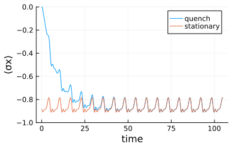

# Floquet dynamics

The package supports time-dependent Hamiltonians. To start, load OrdinaryDiffEq.jl.
```julia
using UniformTEMPO
using OrdinaryDiffEq
```
This activates the extension that allows for proper integration of the system evolution. In particular, one is often interested in a periodic (Floquet) time-dependent system Hamiltonians. Consider for example a driven spin-boson model 
```julia
σz = [1 0; 0 -1]
σx = [0 1; 1 0]
ϵ = ω = 1 # driving amplitude and frequency
h_s(t) = σx + ϵ * cos(t * ω) * σx # time-dependent system Hamiltonian
```
where the system Hamiltonian is now a periodic function. When handling Floquet systems, it is recomended to use the time step value that is commensurate with the driving period. For example
```julia
T = 2π / ω # driving period
δt = T / 60 # commensurate time-step
```
As an example, we use an Ohmic environment with exponential cutoff
```julia
ω_c = 1 # cut-off frequency
α = 0.1 # copuling strength
bcf(t) = α * (ω_c / (1 + im * ω_c * t))^2 # bath correlation function
```
We can now compute a PT-MPO using [`uniTEMPO`](@ref uniTEMPO)
```julia
pt = uniTEMPO(σz, δt, bcf, 1e-6)
```
Having the PT-MPO, we can calculate the time evolution by using the [`evolve`](@ref evolve) function with time-dependent system Hamiltonian
```julia
ρ_0 = [1 0; 0 0] # initial state
n = 1000 # number of time steps
ρ_t = evolve(pt, ρ_0, n, h_s=h_s) # time evolved state
```
After a transient dynamics, the state will reach a Floquet steady state, that is an oscillating state which is stroboscopically invariant. We can determine a Floquet steady state using an eigen decomposition of the Floquet propagator. In order to do this, we first construct a Floquet PT-MPO
```julia
ptf = floquet_process_tensor(pt, h_s, T); #create Floquet PT-MPO
```
See Ref. [[Mickiewicz, Link, Strunz, arXiv.2511.08754 (2025)](https://arxiv.org/abs/08754)] for details. The time-step of this Floquet process tensor is the drive period `T`. Note that in case provided time step is not commensurate with the driving period, the function [`floquet_process_tensor`](@ref floquet_process_tensor) will change it automatically to the closest commensurate value. We can now use Floquet PT-MPO to compute the Floquet steady state
```julia
ρ_f = steadystate(ptf) # compute Floquet steady state
```
In order to extract the steady-state micromotion within a single period input the full computational steadystate in `evolve` and propagate it with the original process tensor
```julia
x_f = steadystate(ptf, return_full=true) # compute computational Floquet steady state
ρ_t_f = evolve(pt, x_f, n, h_s=h_s) # stationary evolution
```
As an example we plot the evolution of $\langle \sigma_x \rangle$

```julia
using Plots
import LinearAlgebra.tr

t_eval = (0:n) * δt
plot(xlabel="time", ylabel="⟨σx⟩", size=(400, 250), ylims=(-1,0))
plot!(t_eval, [real(tr(ρ * σx)) for ρ in ρ_t], label="quench")
plot!(t_eval, [real(tr(ρ * σx)) for ρ in ρ_t_f], label="stationary")
```


