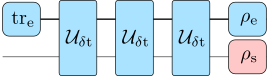
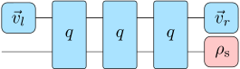

# Introduction

## Basic usage

The algorithm itself is very simple to use: 

(1) Provide a bath correlation function and a coupling operator

```julia
bcf(t) = 0.1 * (5 / (1 + im * 5 * t))^2
s_op = [0 1; 1 0]
```

(2) compute a process tensor MPO using uniTEMPO, 

```julia
using UniformTEMPO
pt = uniTEMPO(σ_x, 0.1, bcf, 1e-8)
```

(3) use it to compute dynamics

```julia
ρ0 = [1 0; 0 0]
ρt = evolve(pt, ρ0, 1000; h_s=[1 0; 0 -1]) # evolve 1000 steps
ρt[end] # system state at the end of the evolution
```

Below is a detailed description with explanations for each step.


## Uniform process tensor MPOs

A uniform process tensor matrix product operator (uniform PT-MPO) is a numerical representation of a (bosonic) quantum environment that obeys a dynamical semi-group, i.e. the system-environment interaction and the bare environment dynamics is time-independent. One can think of it as a compressed representation of the unitary gate of the system-bath interaction for a fixed time-step $\delta t$, where details on the environment are discarded. For instance, the evolution of the system state $\rho_\mathrm{s}$ after three time steps is



In a compressed "MPO" representation the environment is replaced with reduced objects while still reproducing the system dynamics



Uniform PT-MPOs are implemented in UniformTEMPO.jl via the immutable julia struct [`UniformPTMPO`](@ref UniformPTMPO). The fields of this struct are the time-step $\delta t$, boundary vectors $\vec{v}_{r/l}$ (representing bath initial state $\rho_\mathrm{e}$ and bath trace $\mathrm{tr}_\mathrm{e}$) and the time-evolution gate $q$ (representing the gate $\mathcal{U}_{\delta t}$). This represents the complete information of the bath influence onto the system dynamics. 

## Construct process tensor MPOs for a Gaussian bath

Uniform PT-MPOs for Gaussian environments can be constructed with the function [`uniTEMPO`](@ref uniTEMPO) based on the uniTEMPO algorithm. Let's consider as an example the spin boson model. 

$$H = \Omega \sigma_z + \sigma_x \sum_\lambda g_\lambda (b_\lambda+b_\lambda^\dagger)+\sum_\lambda \omega_\lambda b_\lambda^\dagger b_\lambda$$

In uniTEMPO the bath is characterized via the bath correlation function, formally given as

$$\mathrm{bcf}(t-s)=\sum_\lambda g_\lambda \mathrm{tr}_\mathrm{e} \big[(\mathrm{e}^{-i\omega_\lambda t}b_\lambda+\mathrm{e}^{i\omega_\lambda t}b_\lambda^\dagger)(\mathrm{e}^{-i\omega_\lambda s}b_\lambda+\mathrm{e}^{i\omega_\lambda s}b_\lambda^\dagger)\rho_e\big]$$

This should be a continuous function that decays to zero when $(t-s)\rightarrow \infty$. It is the responsibility of the user to provide a fast callabe that provides this function for the given bath model. For example, for an Ohmic bath with exponential high-frequency cutoff at zero temperature (spectral density $J(\omega)=\alpha \omega \exp(-\omega/\omega_c)$)

```julia
ω_c = 5 # cutoff frequency
α = 0.1 # coupling strength
bcf(t) = α * (ω_c / (1 + im * ω_c * t))^2
```

To construct a PT-MPO for this bath we simply provide the bath correlation function $\mathrm{bcf}(t)$, the coupling operator $\sigma_x$, the time-step $\delta t$ and a tolerance parameter determining the compression accuracy

```julia
using UniformTEMPO
σ_x = [0 1; 1 0] # coupling operator
delta_t = 0.1 # Trotter time-step
tol = 1e-8 # uniTEMPO svd cutoff
pt = uniTEMPO(σ_x, delta_t, bcf, tol)
```

Note that all results must be checked for convergence with respect to the Trotter step `delta_t` and the cutoff `tol`. Also note that the `tol` parameter is not independet of `delta_t` and does not determine the actual tolerance of computations. Choosing a lower value of `tol` will generally yield to higher accuracy but higher numerical effort. The bond dimension of the computed PT-MPO is the main parameter that determines the numerical effort

```julia
bond_dim(pt) # 237
```

In this example the bond dimension for the provided tolerance is `237`. The resulting bond dimension cannot be predicted in advance. Therefore it is advised to start with a low tolerance. The bond dimension of the propagator $q$ determines its array size

```julia
size(pt.q) # (237, 4, 237, 4)
```

I.e. $q$ is a linear map on the bond-space and the system density-operator space (dimension `4` in the case of a single spin). We have not yet included the system Hamiltonian into the PT-MPO. This can be done using the [`include_system_hamiltonian`](@ref include_system_hamiltonian) function, in our case

```julia
Ω = 1 # system energy
h_s = Ω * [1 0; 0 -1] # system Hamiltonian
pt_sb = include_system_hamiltonian(pt, h_s) # optional, PT-MPO for spin-boson
```

However, it is not necessary or recommended to construct `pt_sb`, because `h_s` can also be included as an optional argument in the evolution routines. Note that, at this point, a Trotter error of $O(\delta t^3)$ is induced.

## Computing dynamics

Once the PT-MPO is constructed, one can compute local dynamics for arbitrary evolution times. For example, we want to compute the reduced system density matrix for $N$ evolution steps $\delta t$. This can be done using the [`evolve`](@ref evolve) function

```julia
ρ0 = [1 0; 0 0] # system initial state
N = 100 # evolution time steps
ρt = evolve(pt, ρ0, N; h_s=h_s) # same as evolve(pt_sb, ρ0, N)
t_eval = LinRange(0, N * pt.delta_t, N + 1) # time grid for ρt
ρN = ρt[N + 1] # system state at the end of the evolution
```
Several further evolution routines exists, check the example files in the repo. For instance, one can directly determine the [`steadystate`](@ref steadystate) via


```julia
steadystate(pt; h_s=h_s) # computes the steadystate
```

Further routines include 

- [`channel`](@ref channel) and [`choi_channel`](@ref choi_channel) to compute quantum channels.
- [`process_tensor`](@ref process_tensor) to compute process tensors.
- [`two_point_correlations`](@ref two_point_correlations), [`two_point_correlations_frourier`](@ref two_point_correlations_fourier) to compute unequal time correlation functions.